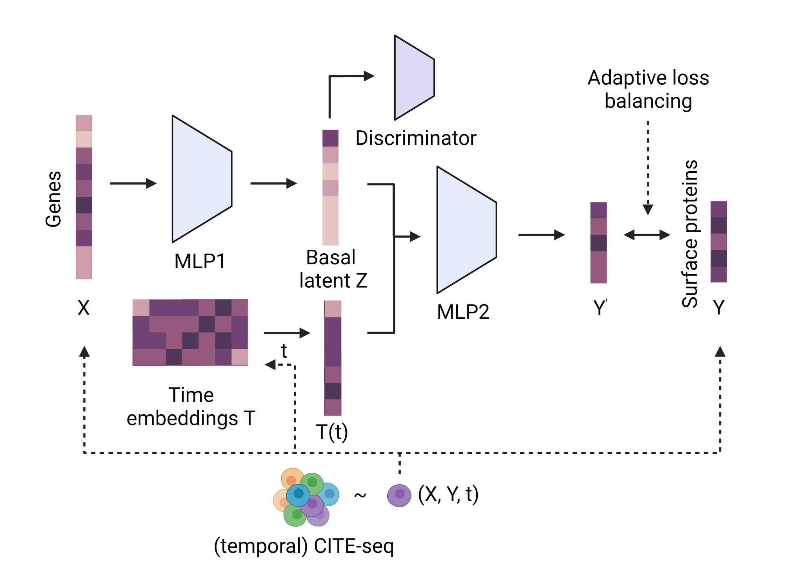

# CrossmodalNet
Interpretable modeling of time-resolved single-cell gene-protein expression <br>
[Preprint](https://www.biorxiv.org/content/10.1101/2023.05.16.541011v2)
<br/>
<p align="center">
    
</p>
<br/>

### Steps
Consider using the following command-line to train a model:
```shell
python3 -m src.train --data_dir PATH_TO_DATA -hp HPARAMS.json --log_dir LOGGER -o Adam -n 500 -v --save
```
After training, follow the following example notebook for testing:
<br>https://github.com/yjgeno/Multimodal_22/blob/main/nb/testing_.ipynb<br>


(c) 2023 Yongjian Yang, Texas A&M University <br>
The content of this repository is licensed under the MIT license.
